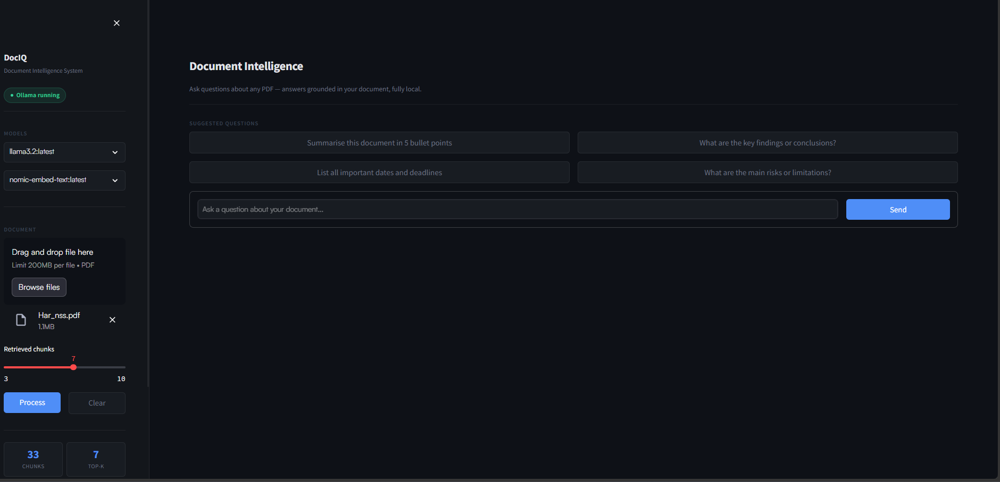
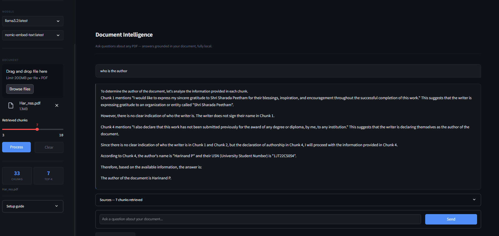

# DocIQ — Document Intelligence System

> Ask natural language questions about any PDF. Fully local, no API keys, no data leaves your machine.


***

## Overview

DocIQ is a **Retrieval-Augmented Generation (RAG)** application that lets you upload any PDF and ask questions about it in plain English. It retrieves the most relevant passages from your document and generates grounded, cited answers using a local LLM via Ollama.

Works with research papers, compliance documents, SOPs, contracts, resumes — any PDF.

***

## Demo

| Upload | Ask | Answer |
|--------|-----|--------|
| Any PDF | Natural language question | Cited answer with source chunks |
| Research paper | "What methodology was used?" | Grounded answer with page references |
| Compliance doc | "List all GMP requirements" | Extracted requirements with citations |
| Resume | "What are the candidate's Python skills?" | Summarised skills from document |

***

## Stack

| Layer | Technology | Purpose |
|-------|------------|---------|
| UI | Streamlit | Chat interface |
| Orchestration | LangChain LCEL | Pipeline composition |
| LLM | Ollama (`llama3.2`) | Answer generation |
| Embeddings | Ollama (`nomic-embed-text`) | PDF vectorisation |
| Vector store | ChromaDB | Chunk storage and retrieval |
| PDF parsing | PyPDF | Text extraction |

***

## How It Works

```
PDF Upload
    │
    ▼
PyPDFLoader → RecursiveCharacterTextSplitter
(1000 token chunks, 150 token overlap)
    │
    ▼
nomic-embed-text (Ollama) → 768-dim vectors
    │
    ▼
ChromaDB (local, ./chroma_db/<session-uuid>/)
    │
    ┌──────────── at query time ────────────────┐
    │                                           │
    ▼                                           ▼
Embed question                           MMR retrieval
(same model)                             (top-K diverse chunks)
    │                                           │
    └───────────────────┬───────────────────────┘
                        │
                        ▼
            LangChain Prompt Builder
         system prompt + few-shot examples
         + chain-of-thought + retrieved chunks
                        │
                        ▼
              llama3.2 (Ollama, local)
              temperature = 0.2
                        │
                        ▼
          Cited answer in Streamlit chat UI
           + expandable source chunk viewer
```

### Prompt Engineering

Three techniques are combined in every query:

1. **Grounded system prompt** — instructs the model to answer only from provided context and always cite the source page/section
2. **Few-shot examples** — two hardcoded Q&A pairs demonstrate the expected output format before the real question
3. **Chain-of-thought trigger** — the human turn ends with `"Step-by-step reasoning:"`, which improves factual accuracy on complex queries

### Why MMR over simple similarity?

Maximum Marginal Relevance balances **relevance** (close to your question) with **diversity** (not all chunks saying the same thing). This prevents retrieving five near-duplicate passages and instead surfaces broader context from across the document.

***
## Screenshots


*Upload any PDF and get started with suggested questions*


*Grounded answers with page-level citations*


## Quick Start

### 1. Install Ollama

Download from [ollama.com/download](https://ollama.com/download) and install.

### 2. Pull required models

```bash
ollama pull llama3.2
ollama pull nomic-embed-text
```

### 3. Clone and install

```bash
git clone https://github.com/yourusername/dociq.git
cd dociq

python -m venv venv
source venv/bin/activate        # Mac/Linux
venv\Scripts\activate           # Windows

pip install -r requirements.txt
```

### 4. Run

```bash
streamlit run app.py
```

Open [http://localhost:8501](http://localhost:8501)

> **Windows:** Ollama auto-starts on boot. Do **not** run `ollama serve` manually — this causes a `[WinError 10048]` port conflict. Just run the app directly.

***

## Project Structure

```
dociq/
├── app.py                  # Streamlit UI — sidebar, chat, model selector
├── utils/
│   ├── __init__.py
│   ├── pdf_processor.py    # PDF loading, chunking, embedding, ChromaDB
│   └── rag_chain.py        # RAG chain, prompt engineering, retrieval
├── requirements.txt
├── .gitignore
└── README.md
```

***

## Configuration

All parameters are configurable without touching code — either in the UI or at the top of `pdf_processor.py` / `rag_chain.py`.

| Parameter | Default | Where |
|-----------|---------|-------|
| `chunk_size` | 1000 tokens | `pdf_processor.py` |
| `chunk_overlap` | 150 tokens | `pdf_processor.py` |
| `top_k` | 5 | UI slider (3–10) |
| `fetch_k` | `top_k × 2` | `rag_chain.py` |
| `temperature` | 0.2 | `rag_chain.py` |
| LLM model | `llama3.2` | UI dropdown (auto-detected) |
| Embed model | `nomic-embed-text` | UI dropdown (auto-detected) |

***

## Recommended Models

### LLMs (answer generation)

```bash
ollama pull llama3.2          # 2 GB  — default, fast
ollama pull llama3.1:8b       # 4.7 GB — better reasoning
ollama pull mistral           # 4.1 GB — good for structured documents
ollama pull phi3              # 2.3 GB — lightweight
```

### Embedding models

```bash
ollama pull nomic-embed-text  # 274 MB — 768-dim, recommended
ollama pull mxbai-embed-large # 669 MB — 1024-dim, higher quality
ollama pull all-minilm        # 46 MB  — lightest option
```

> **Important:** If you switch embedding models, delete `chroma_db/` and reprocess your PDF. Vectors from different models are incompatible and cannot be mixed in the same collection.

***

## Windows File-Lock Fix

This project uses a **unique ChromaDB subdirectory per upload session** (`chroma_db/<uuid>/`) to avoid `[WinError 32] The process cannot access the file because it is being used by another process` errors, which occur when Windows holds a file lock on active ChromaDB binaries during folder deletion.

The cleanup sequence on each new upload:
1. Set the old vectorstore reference to `None` in session state
2. Force Python garbage collection (`gc.collect()`)
3. Wait briefly for OS to release file handles
4. Delete the old session directory with up to 5 retries
5. Create a new unique directory for the incoming document

***

## Extending the Project

| Feature | Approach |
|---------|----------|
| Multi-document support | Tag chunks by doc ID in metadata; add a document selector to the UI |
| Conversation memory | Add `ConversationBufferWindowMemory` to the LangChain chain |
| Re-ranking | Use a local `CrossEncoderReranker` after MMR retrieval |
| Streaming answers | Replace `.invoke()` with `.stream()` and use `st.write_stream()` |
| GPU acceleration | Pass `num_gpu=1` to `ChatOllama()` |
| Cloud deployment | Replace local ChromaDB with Qdrant Cloud or Pinecone (both free tiers) |

***

## License

MIT — free to use, modify, and deploy.

***

*Built with Python · LangChain · ChromaDB · Ollama · Streamlit*
